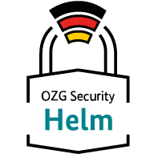

    

**Contents / Quick navigation**

[[_TOC_]]

# OZG Security Challenge - Helm Chart

In this repository, you will find the Helm Chart, which was developed as part of the OZG Security Challenge. The Helm Chart allows you to quickly install the components of the OZG Security Challenge in a Kubernetes environment.

Components:

- [Best Practice Scanner](https://gitlab.opencode.de/bmi/ozg-rahmenarchitektur/ozgsec/ozgsec-best-practice-scanner)
- [Web Frontend](https://gitlab.opencode.de/bmi/ozg-rahmenarchitektur/ozgsec/ozgsec-web-frontend)
- Keycloak with [Custom Theme](https://gitlab.opencode.de/bmi/ozg-rahmenarchitektur/ozgsec/ozgsec-keycloak)
- Postgres database
- Redis Cache
- RabbitMQ Message Broker

### Background

With public administration becoming more digital, the importance of information security is growing. Citizens and companies expect the state to protect their personal information with high levels of IT security. The [Federal Ministry of the Interior and Community (BMI)](https://www.bmi.bund.de/DE/startseite/startseite-node.html) would therefore like to further promote the increase in IT security during the implementation of the OZG and has launched the ‘OZG Security Challenge 2023’ in cooperation with the [Federal Office for Information Security (BSI)](https://www.bsi.bund.de/DE/Home/home_node.html). Within this scope, the ‘OZG Security Quick Test’ and the associated ‘Helm Chart’ were developed.

## Installation

You can install the Helm Chart by following the steps below:

1. `helm repo add ozgsec https://gitlab.opencode.de/api/v4/projects/2826/packages/helm/stable`
2. `helm repo update`
3. `helm upgrade --install ozgsec ozgsec/ozgsec --namespace=<your-namespace>`

__Note:__ The provision of Helm Charts via GitLab is currently still a feature in beta. Alternatively, you can install the Helm Chart directly from this repository:

1. `git clone git@gitlab.opencode.de:bmi/ozg-rahmenarchitektur/ozgsec/ozgsec-helm-chart.git`
2. `cd ozgsec-helm-chart`
3. `helm dependency update ./charts/ozgsec`
4. `helm upgrade --install ozgsec ./charts/ozgsec --namespace=<your-namespace>`

## Configuration

The Helm Chart can be configured via the [values.yaml](./charts/ozgsec/values.yaml) file. Here you can, for example, adjust the number of replicas or the resource limits.

### Activated checks

The checks that are to be executed by the Best Practice Scanner can be defined in the Helm Chart via the configuration `bestPracticesScanner.config.enabledChecks`. 

## Collaboration

Would you like to participate in further development? You are welcome to actively contribute to this repository, e.g. with merge requests, application questions or suggestions. Further information can be found here: [CONTRIBUTING.md](./CONTRIBUTING-en.md).

## Licence

This project is licensed under the [EUPL-1.2](./LICENSE.md) licence.
