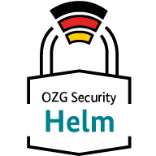

    

**Inhalte / Schnellnavigation**

[[_TOC_]]

_[English version available](./README-en.md)_

# OZG Security Challenge - Helm Chart

In diesem Repository finden Sie das Helm Chart, welches im Rahmen der OZG-Security-Challenge entwickelt wurde. Das Helm Chart ermöglicht die schnelle Installation der Komponenten der OZG-Security-Challenge in einer Kubernetes-Umgebung.

Komponenten: 

- [Best Practice Scanner](https://gitlab.opencode.de/bmi/ozg-rahmenarchitektur/ozgsec/ozgsec-best-practice-scanner)
- [Web Frontend](https://gitlab.opencode.de/bmi/ozg-rahmenarchitektur/ozgsec/ozgsec-web-frontend)
- Keycloak mit [Custom Theme](https://gitlab.opencode.de/bmi/ozg-rahmenarchitektur/ozgsec/ozgsec-keycloak)
- Postgres-Datenbank
- Redis Cache
- RabbitMQ Message Broker

### Hintergrund

Mit der zunehmenden Digitalisierung der öffentlichen Verwaltung steigt die Bedeutung der zugrundeliegenden Informationssicherheit. Bürgerinnen, Bürger und Unternehmen erwarten, dass der Staat vertrauensvoll mit ihren persönlichen Daten umgeht und diese durch ein hohes Maß an IT-Sicherheit schützt. Das [Bundesministerium des Innern und für Heimat (BMI)](https://www.bmi.bund.de/DE/startseite/startseite-node.html) möchte daher die Steigerung der IT-Sicherheit bei der OZG-Umsetzung weiter vorantreiben und hat in Zusammenarbeit mit dem [Bundesamt für Sicherheit in der Informationstechnik (BSI)](https://www.bsi.bund.de/DE/Home/home_node.html) die „OZG-Security-Challenge 2023“ ins Leben gerufen. In diesem Rahmen wurde der „OZG-Security-Schnelltest“ und das hier vorliegende zugehörige „Helm Chart“ entwickelt.

## Installation

Sie können das Helm Chart über die folgenden Schritte installieren:

1. `helm repo add ozgsec https://gitlab.opencode.de/api/v4/projects/2826/packages/helm/stable`
2. `helm repo update`
3. `helm upgrade --install ozgsec ozgsec/ozgsec --namespace=<your-namespace>`

__Hinweis:__ Die Bereitstellung von Helm Charts über GitLab ist aktuell noch ein Feature in der Beta-Phase. Alternativ können Sie das Helm Chart auch direkt aus diesem Repository installieren:

1. `git clone git@gitlab.opencode.de:bmi/ozg-rahmenarchitektur/ozgsec/ozgsec-helm-chart.git`
2. `cd ozgsec-helm-chart`
3. `helm dependency update ./charts/ozgsec`
4. `helm upgrade --install ozgsec ./charts/ozgsec --namespace=<your-namespace>`

## Konfiguration

Das Helm Chart kann über die [values.yaml](./charts/ozgsec/values.yaml) Datei konfiguriert werden. Hier können Sie z. B. die Anzahl der Replikas oder die Ressourcenlimits anpassen.

### Aktivierte Checks

Die Checks, die durch den Best Practice Scanner ausgeführt werden sollen bzw. in der Installation zur Verfügung stehen, können in dem Helm Chart über die Konfiguration `bestPracticesScanner.config.enabledChecks` definiert werden. 

## Mitarbeit

Möchten Sie sich an der Weiterentwicklung beteiligen? Bringen Sie sich gerne aktiv, z. B. mit Änderungsvorschlägen (Merge Requests) oder durch Anwendungsfragen bzw. Vorschläge hier in diesem Repository ein. Weitere Informationen dazu finden Sie hier: [CONTRIBUTING.md](./CONTRIBUTING.md).

## Lizenz

Dieses Projekt ist lizenziert unter der [EUPL-1.2](./LICENSE.md) Lizenz.