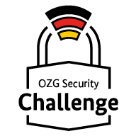

    

**Contents / Quick navigation**

[[_TOC_]]

# OZG Security Challenge

In this repository you will find the static information page for the OZG Security Challenge 2023.

## Projects

- [Best Practice Scanner](https://gitlab.opencode.de/bmi/ozg-rahmenarchitektur/ozgsec/ozgsec-best-practice-scanner)
- [Web Frontend](https://gitlab.opencode.de/bmi/ozg-rahmenarchitektur/ozgsec/ozgsec-web-frontend)
- [Keycloak](https://gitlab.opencode.de/bmi/ozg-rahmenarchitektur/ozgsec/ozgsec-keycloak)
- [Helm Chart](https://gitlab.opencode.de/bmi/ozg-rahmenarchitektur/ozgsec/ozgsec-helm-chart)

## Background

With public administration becoming more digital, the importance of information security is growing. Citizens and companies expect the state to protect their personal information with high levels of IT security. The [Federal Ministry of the Interior and Community (BMI)](https://www.bmi.bund.de/DE/startseite/startseite-node.html) would therefore like to further promote the increase in IT security during the implementation of the OZG and has launched the ‘OZG Security Challenge 2023’ in cooperation with the [Federal Office for Information Security (BSI)](https://www.bsi.bund.de/DE/Home/home_node.html).

## Collaboration

Would you like to participate in the further development? You are welcome to actively contribute to this repository, e.g. with suggestions for changes (merge requests) or with questions or suggestions. Further information can be found here: [CONTRIBUTING-en.md](./CONTRIBUTING-en.md).

## Licence

This project is licensed under the [EUPL-1.2](./LICENSE.md) licence.

### Note

This project was used for the GitLab page: [Zielbild OZG-Rahmenarchitektur](https://gitlab.opencode.de/bmi/ozg-rahmenarchitektur/zielbild-ozg-rahmenarchitektur/)
