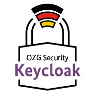

    

**Inhalte / Schnellnavigation**

[[_TOC_]]

# OZG Security Challenge - Keycloak Theme

In diesem Repository finden Sie das Keycloak Theme, welches im Rahmen der OZG-Security-Challenge entwickelt wurde. Keycloak ist ein Open Source Identity and Access Management (IAM) System. Im Rahmen der OZG-Security-Challenge wurde ein eigenes Keycloak Theme entwickelt, um eine einheitliche und benutzerfreundliche Oberfläche für die Authentifizierung und Autorisierung von Nutzern zu schaffen.

## Hintergrund

Mit der zunehmenden Digitalisierung der öffentlichen Verwaltung steigt die Bedeutung der zugrundeliegenden Informationssicherheit. Bürgerinnen, Bürger und Unternehmen erwarten, dass der Staat vertrauensvoll mit ihren persönlichen Daten umgeht und diese durch ein hohes Maß an IT-Sicherheit schützt. Das [Bundesministerium des Innern und für Heimat (BMI)](https://www.bmi.bund.de/DE/startseite/startseite-node.html) möchte daher die Steigerung der IT-Sicherheit bei der OZG-Umsetzung weiter vorantreiben und hat in Zusammenarbeit mit dem [Bundesamt für Sicherheit in der Informationstechnik (BSI)](https://www.bsi.bund.de/DE/Home/home_node.html) die „OZG-Security-Challenge 2023“ ins Leben gerufen.

## Mitarbeit

Möchten Sie sich an der Weiterentwicklung beteiligen? Bringen Sie sich gerne aktiv, z. B. mit Änderungsvorschlägen (Merge Requests) oder durch Anwendungsfragen bzw. Vorschläge hier in diesem Repository ein. Weitere Informationen dazu finden Sie hier: [CONTRIBUTING.md](./CONTRIBUTING.md).

## Lizenz

Dieses Projekt ist lizenziert unter der [EUPL-1.2](./LICENSE.md) Lizenz.